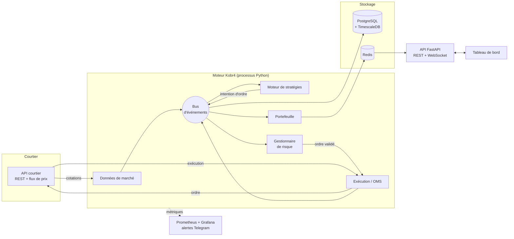
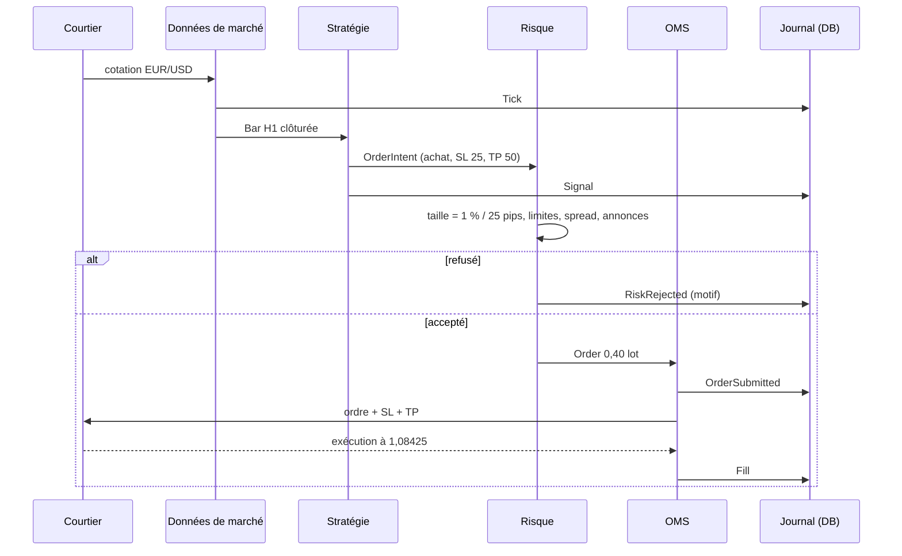
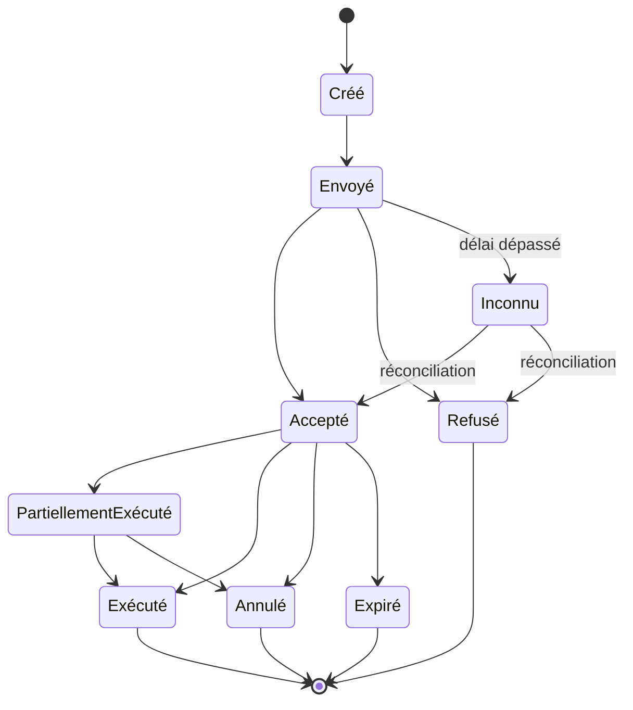
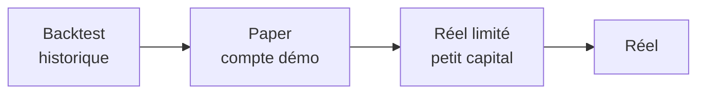

# Architecture — Kobr4 FX

Document de référence de l'architecture du bot de trading forex. Toute décision structurante qui s'en écarte doit être ajoutée dans la section [Décisions](#10-décisions-darchitecture).

---

## 1. Objectifs et contraintes

**Objectif** : un bot de trading forex automatisé, fiable 24h/24 5j/7, capable de faire tourner plusieurs stratégies sur plusieurs paires, avec un contrôle du risque strict et une traçabilité complète de chaque décision.

**Hors périmètre** : le trading haute fréquence (latence en microsecondes, accès direct au marché). Le bot passe par l'API d'un courtier ; la cible de latence est de l'ordre de 10 à 100 ms entre un signal et l'envoi de l'ordre.

| Exigence | Cible |
|---|---|
| Disponibilité pendant les heures de marché | 99,5 % (dim. 22h UTC → ven. 22h UTC) |
| Délai signal → ordre envoyé | < 100 ms |
| Reprise après crash | < 1 min, avec réconciliation des positions auprès du courtier |
| Traçabilité | 100 % des signaux, ordres, exécutions et refus du risque enregistrés |
| Écart backtest / réel | Même code de stratégie et de risque dans les deux modes |

## 2. Principes

1. **Un seul code pour le backtest, le paper trading et le réel.** Une stratégie ne sait pas dans quel mode elle tourne. Elle reçoit des événements et émet des intentions d'ordre. Seuls l'horloge et l'adaptateur de courtier changent.
2. **Aucune stratégie ne parle au courtier.** Toute intention d'ordre passe par le gestionnaire de risque, qui peut la refuser ou la réduire. C'est le seul chemin vers le marché.
3. **Indépendant du courtier.** Le cœur ne connaît qu'une interface `Broker`. Chaque courtier est un adaptateur (OANDA en premier, puis Interactive Brokers ou autre).
4. **Tout est un événement, et tout événement est enregistré.** Cotations, bougies, signaux, décisions du risque, ordres, exécutions. On peut rejouer une journée à l'identique pour comprendre une décision.
5. **Sécurité par défaut.** Chaque ordre part avec un stop loss côté courtier. En cas de perte de connexion, de données périmées ou d'erreur inconnue, le bot cesse d'ouvrir des positions. Au démarrage, il réconcilie son état avec le courtier avant toute action.
6. **Rigueur numérique.** Prix et montants en `Decimal`, jamais en `float`. Toutes les dates en UTC.
7. **Monolithe modulaire d'abord.** Un seul processus avec des modules séparés par un bus d'événements interne. Le découpage en services ne se fait que lorsqu'un besoin réel apparaît (voir [§8](#8-montée-en-charge)).

## 3. Vue d'ensemble



## 4. Composants

### 4.1 Cœur (`core`)
Modèles du domaine et infrastructure commune, sans dépendance vers un courtier ni une base.
- **Modèles** : `Instrument`, `Tick`, `Bar`, `OrderIntent`, `Order`, `Fill`, `Position`, `Account`. Objets immuables (pydantic ou dataclasses figées).
- **Bus d'événements** : publication / abonnement asynchrone en mémoire (asyncio). Interface abstraite pour pouvoir passer à Redis Streams ou NATS plus tard sans toucher aux modules.
- **Horloge** : `LiveClock` (heure réelle) et `SimulatedClock` (pilotée par les données en backtest). Aucun module n'appelle `datetime.now()` directement.

### 4.2 Données de marché (`marketdata`)
- Connexion au flux de prix du courtier, reconnexion automatique avec backoff.
- Normalisation des cotations en `Tick` (bid, ask, heure UTC).
- Construction des bougies M1 → M5, M15, H1, H4, D1.
- Détection de données périmées : si aucune cotation depuis N secondes pendant les heures de marché, émission de `MarketDataStale`, qui bloque les nouvelles entrées.
- Téléchargement de l'historique pour le backtest.

### 4.3 Moteur de stratégies (`strategies`)
Chaque stratégie implémente une interface unique :

```python
class Strategy(Protocol):
    id: str
    instruments: list[str]
    timeframe: Timeframe

    def on_start(self, ctx: StrategyContext) -> None: ...
    def on_bar(self, bar: Bar, ctx: StrategyContext) -> list[OrderIntent]: ...
    def on_fill(self, fill: Fill, ctx: StrategyContext) -> None: ...
```

- `StrategyContext` donne accès en lecture aux indicateurs, aux positions de la stratégie et à l'horloge. Aucun accès au courtier.
- Une `OrderIntent` exprime une intention (« acheter EUR/USD, SL 25 pips, TP 50 pips »), **sans taille**. La taille est calculée par le risque.
- Paramètres chargés depuis un fichier de configuration versionné.
- Premières stratégies : croisement EMA (tendance), RSI (retour à la moyenne), cassure de range.

### 4.4 Gestionnaire de risque (`risk`)
Point de passage obligatoire. Transforme une `OrderIntent` en `Order` ou la refuse avec un motif enregistré.

| Règle | Exemple de réglage |
|---|---|
| Taille de position selon le risque | 1 % du capital / distance du stop |
| Stop loss obligatoire | Refus de toute intention sans SL |
| Nombre max de positions ouvertes | 5 au total, 1 par paire et par stratégie |
| Exposition max par devise | 3 % de risque cumulé sur l'USD, par exemple |
| Perte journalière max | 3 % du capital → arrêt des entrées jusqu'au lendemain |
| Drawdown max | 10 % depuis le plus haut → arrêt complet, intervention manuelle |
| Spread max | Refus si spread > 2× le spread habituel de la paire |
| Fenêtres d'annonces | Pas d'entrée 30 min avant et après une annonce majeure |
| Sessions autorisées | Selon la stratégie (Londres, New York…) |
| Arrêt d'urgence | Coupe toutes les entrées et peut clôturer toutes les positions |

### 4.5 Exécution / OMS (`execution`)
- Machine à états de chaque ordre (voir [§5.2](#52-cycle-de-vie-dun-ordre)).
- Identifiant client unique par ordre, pour ne jamais envoyer deux fois le même ordre après une coupure.
- Envoi via l'adaptateur `Broker`, gestion des refus, des exécutions partielles et des délais d'attente.
- **Réconciliation** au démarrage puis toutes les minutes : compare positions et ordres locaux avec ceux du courtier. En cas d'écart, alerte et blocage des entrées.

Interface des adaptateurs :

```python
class Broker(Protocol):
    async def connect(self) -> None: ...
    async def stream_prices(self, instruments: list[str]) -> AsyncIterator[Tick]: ...
    async def submit(self, order: Order) -> BrokerAck: ...
    async def cancel(self, order_id: str) -> None: ...
    async def modify(self, order_id: str, sl: Decimal | None, tp: Decimal | None) -> None: ...
    async def positions(self) -> list[Position]: ...
    async def open_orders(self) -> list[Order]: ...
    async def account(self) -> Account: ...
    def fills(self) -> AsyncIterator[Fill]: ...
```

Adaptateurs prévus : `SimulatedBroker` (backtest), `OandaBroker` (démo puis réel), `IBBroker` (plus tard).

### 4.6 Portefeuille (`portfolio`)
Positions, P&L réalisé et flottant, équité, marge, drawdown, statistiques par stratégie. Publie un instantané toutes les secondes vers Redis pour le tableau de bord.

### 4.7 Backtest (`backtest`)
- Rejoue l'historique à travers **les mêmes** stratégies, le même risque et l'OMS, avec `SimulatedClock` et `SimulatedBroker`.
- Le courtier simulé modélise le spread réel (bid/ask), le glissement, les commissions et le swap de nuit.
- Rapport : rendement, drawdown max, ratio de Sharpe, profit factor, taux de réussite, espérance par trade, courbe d'équité.
- Walk-forward et tests hors échantillon pour limiter la sur-optimisation.

### 4.8 API et tableau de bord (`api`, `dashboard`)
- **FastAPI** : REST (configuration, historique, rapports de backtest) et WebSocket (cotations, positions, journal en direct).
- Authentification obligatoire (compte unique + 2FA au début).
- Actions sensibles (arrêt d'urgence, passage en réel, changement de paramètres) enregistrées dans le journal d'audit.
- **Tableau de bord** : la maquette actuelle, portée en React + TypeScript.

### 4.9 Supervision (`monitoring`)
- Métriques Prometheus : latence signal → ordre, âge de la dernière cotation, ordres refusés, écart de réconciliation, P&L, drawdown.
- Grafana pour les graphiques.
- Alertes Telegram : crash, perte de connexion, arrêt par le risque, écart de réconciliation, ordre refusé par le courtier.
- Contrôle de vie externe (heartbeat) : si le bot ne répond plus, alerte depuis l'extérieur du serveur.

## 5. Flux

### 5.1 D'une cotation à un ordre



### 5.2 Cycle de vie d'un ordre



L'état `Inconnu` est essentiel : après un délai dépassé, on ne renvoie jamais l'ordre à l'aveugle. On interroge le courtier avec l'identifiant client.

## 6. Données

PostgreSQL avec l'extension TimescaleDB pour les séries temporelles.

| Table | Contenu | Type |
|---|---|---|
| `instruments` | Paires, taille du pip, décimales, taille de lot | référence |
| `ticks` | Cotations bid/ask | hypertable, compressée après 7 jours |
| `bars` | Bougies par unité de temps | hypertable |
| `events` | Journal de tous les événements (JSON), en ajout seul | hypertable |
| `orders` | Ordres et état courant | transactionnel |
| `fills` | Exécutions | transactionnel |
| `positions` | Positions ouvertes et fermées | transactionnel |
| `account_snapshots` | Équité, marge, drawdown | hypertable |
| `backtest_runs` | Paramètres, résultats, rapport | analytique |
| `audit_log` | Actions humaines (arrêt, config, passage en réel) | ajout seul |

Redis sert de cache d'état en direct (dernier prix, positions, équité) pour l'API.

Sauvegardes : dump quotidien de la base vers un stockage externe chiffré, rétention 30 jours.

## 7. Technologies

| Rôle | Choix |
|---|---|
| Langage | Python 3.12, `asyncio` |
| Gestion du projet | `uv` |
| Qualité | `ruff` (lint + format), `mypy --strict`, `pytest`, `hypothesis` |
| Modèles | `pydantic` v2 |
| Calcul | `numpy`, `polars` (backtests) |
| Base | PostgreSQL 16 + TimescaleDB, `asyncpg`, migrations `alembic` |
| Cache / état direct | Redis 7 |
| API | FastAPI + Uvicorn |
| Tableau de bord | React + TypeScript + Vite |
| Supervision | Prometheus, Grafana, alertes Telegram |
| Déploiement | Docker Compose sur VPS Linux à Londres (LD4) |
| CI | GitHub Actions : lint, typage, tests, backtest de non-régression |

## 8. Montée en charge

| Étape | Déclencheur | Changement |
|---|---|---|
| 1. Monolithe modulaire | Démarrage | Un processus, bus en mémoire |
| 2. Processus séparés | Plus de ~10 stratégies ou besoin d'isoler un crash | Bus sur Redis Streams ; un processus pour données + OMS + risque, un par groupe de stratégies |
| 3. Plusieurs courtiers / comptes | Diversification du risque courtier | Un OMS par compte, risque global au-dessus |
| 4. Calcul intensif | Backtests trop lents | Parties critiques en Rust (PyO3), backtests parallélisés |

Le risque et l'OMS restent toujours un point unique par compte, pour garder une vision cohérente de l'exposition.

## 9. Environnements et passage en réel



| Passage | Critères minimum |
|---|---|
| Backtest → Paper | 3 ans d'historique minimum, résultats positifs hors échantillon, drawdown max < 15 % |
| Paper → Réel limité | 4 semaines en démo sans incident technique, résultats cohérents avec le backtest |
| Réel limité → Réel | 3 mois en réel limité, écart backtest / réel expliqué |

Le passage en réel est une action manuelle, enregistrée dans l'audit, qui exige une clé API distincte.

### Sécurité
- Clés API du courtier dans les secrets de l'environnement (Docker secrets), jamais dans le dépôt.
- Clés courtier sans droit de retrait quand le courtier le permet.
- VPS : accès SSH par clé uniquement, pare-feu fermé sauf HTTPS, tableau de bord derrière authentification.
- Comptes démo et réel séparés dans la configuration ; le mode réel se lance avec un fichier de configuration distinct.

## 10. Décisions d'architecture

| # | Décision | Alternative écartée | Raison |
|---|---|---|---|
| 1 | Python | C++, Rust | La latence est dominée par le réseau et le courtier, pas par le calcul. Python donne l'écosystème data et la vitesse de développement. |
| 2 | Moteur maison, léger | NautilusTrader | Contrôle total sur le risque et l'OMS, et pas d'adaptateur OANDA officiel. NautilusTrader reste une option si le moteur maison devient trop coûteux à maintenir. |
| 3 | Monolithe modulaire | Microservices dès le départ | Moins de pièces à faire tomber en panne. Le bus abstrait permet de découper plus tard. |
| 4 | OANDA comme premier courtier | MetaTrader 5 | API REST propre, compte démo gratuit, fonctionne sous Linux. À confirmer selon la disponibilité pour un compte en France. |
| 5 | PostgreSQL + TimescaleDB | InfluxDB, fichiers Parquet seuls | Une seule base pour les séries temporelles et les données transactionnelles. Parquet reste utilisé pour exporter les données de backtest. |
| 6 | Taille calculée par le risque | Taille décidée par la stratégie | Une seule règle de dimensionnement, appliquée partout. |

## 11. Organisation du dépôt

```
Kobr4/
├── src/kobr4/
│   ├── core/            # modèles, événements, bus, horloge
│   ├── marketdata/      # flux de prix, bougies, historique
│   ├── strategies/      # stratégies + indicateurs
│   ├── risk/            # règles de risque, dimensionnement, arrêt d'urgence
│   ├── execution/       # OMS, réconciliation
│   │   └── brokers/     # simulated.py, oanda.py, ib.py
│   ├── portfolio/       # positions, P&L, statistiques
│   ├── backtest/        # moteur de rejeu, rapports
│   ├── storage/         # accès base, migrations
│   ├── api/             # FastAPI
│   ├── monitoring/      # métriques, alertes
│   └── app.py           # point d'entrée, assemblage des modules
├── dashboard/           # React + TypeScript
├── config/              # paper.yaml, live.yaml, strategies/*.yaml
├── tests/               # unitaires, intégration, backtests de référence
├── deploy/              # docker-compose.yml, Dockerfile, Grafana
├── maquette/            # maquette HTML actuelle
└── docs/
```

## 12. Feuille de route

| Phase | Livrable | Résultat vérifiable |
|---|---|---|
| 0. Fondations | Dépôt, CI, modèles du domaine, bus, horloge, configuration | `pytest` et `mypy` passent en CI |
| 1. Données | Adaptateur OANDA (lecture), stockage des cotations, bougies, téléchargement de l'historique | 3 ans de H1 sur 7 paires en base |
| 2. Backtest | Courtier simulé, stratégie EMA, rapport | Rapport de backtest EMA reproductible |
| 3. Risque + OMS | Toutes les règles du §4.4, machine à états, réconciliation | Tests couvrant chaque règle de refus |
| 4. Paper trading | Déploiement VPS, supervision, alertes, OANDA démo | Bot en démo 24h/24 pendant 4 semaines |
| 5. Tableau de bord | API + dashboard React connectés au bot | Maquette alimentée par les vraies données |
| 6. Réel limité | Configuration réelle, audit, procédure d'arrêt | Critères du §9 remplis |
